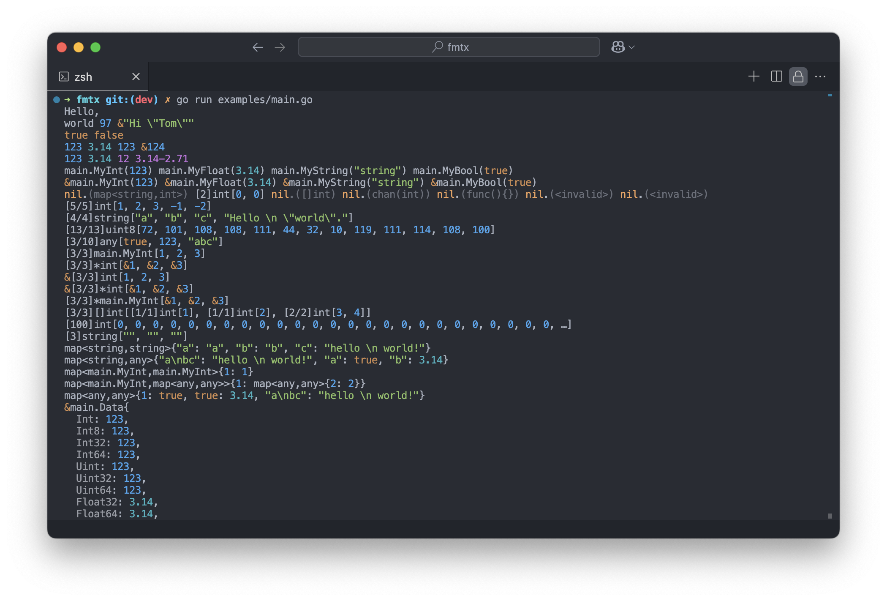

# fmtx

Better Formatting and Printing in Golang

```sh
go get github.com/mengdu/fmtx
```

```go
func main() {
  // fmtx.EnableColor = false
  // fmtx.Options.MaxDepth = 5

  fmtx.Println(123, 3.14, ptr(124), MyInt(123), ptr(MyInt(123)))
  fmtx.Println([]int{1, 2, 3, -1, -2})
  fmtx.Println([]string{"a", "b", "c", "Hello \n \"world\"."})
}
```



## Benchmark

```sh
go test -bench=^Benchmark -benchtime=5s
```

```
goos: darwin
goarch: amd64
pkg: github.com/mengdu/fmtx
cpu: Intel(R) Core(TM) i7-10700K CPU @ 3.80GHz
BenchmarkString-16                         23042            265536 ns/op
BenchmarkStringDisableColor-16             42644            139462 ns/op
BenchmarkSprintf-16                       965110              6172 ns/op
PASS
ok      github.com/mengdu/fmtx  22.468s
```
